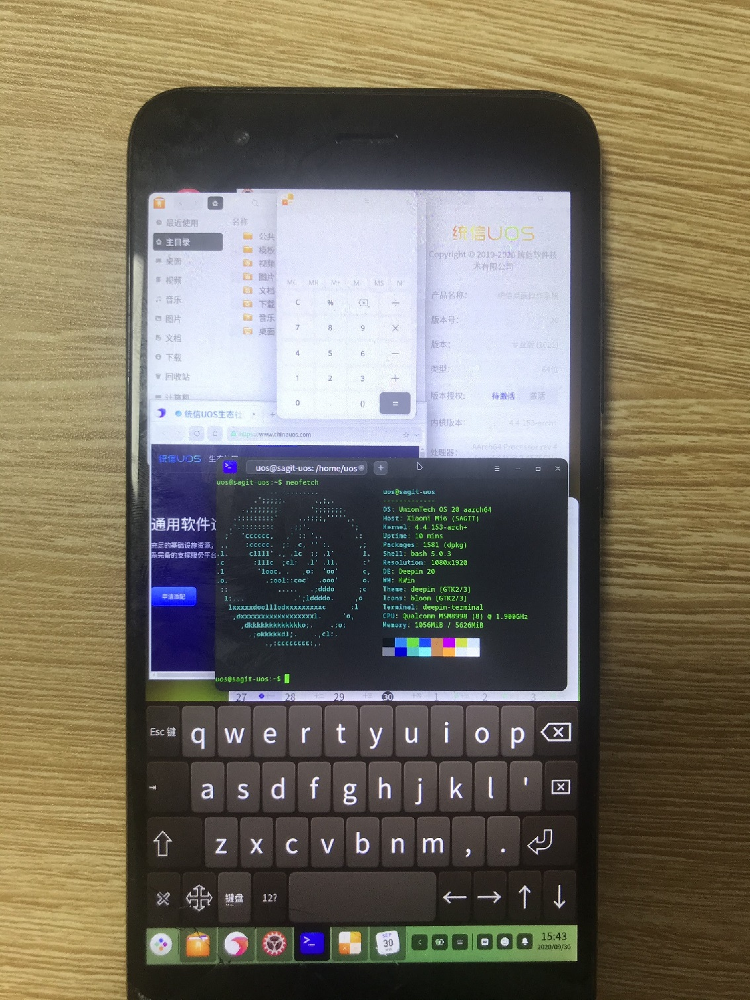

# 小米6运行UOS

## 在哪里下载
​	GitHub: [PreTest-0.0.1](https://github.com/BigfootACA/sagit-uos/releases/tag/PreTest-0.0.1)
​	OneDrive: [MI6-UOS-PreTest-0.0.1.7z](https://1drv.ms/u/s!AsDs1e5NdflSjluG9D3yo0WqhBl9?e=lFewBb)
​	百度网盘: [提取码：n5vv](https://pan.baidu.com/s/1yZ9ddO2aIeJPPQIkPUPDKQ)

## 注意事项

1. 刷入该刷机包会导致所有用户数据被清空，包括用户数据，内部存储，安卓系统。
2. 该刷机包没有经过全面测试，仅使用一台小米6进行开发，所以可能无法启动。
3. 由于非官方支持版本，所以该系统未经任何优化，使用过程会出现但不限于卡顿，崩溃，无响应等异常。
4. 该版本为预览版，无法保证长时间使用的稳定性，使用后建议刷回安卓系统。
5. 由于技术原因，刷机包仅支持小部分功能，在未来版本可能修复。
6. 如果发现问题请及时反馈，也可以提出一些功能性的建议。
7. **未经授权，请勿转载，否则将会追究法律责任。**

## 安装指南

### 直接从手机安装

1. **手机先备份，不然刷完数据就都没了，包括软件，相册，联系人，聊天记录等。**
2. 确认你的手机已经解锁了（[解BL锁](http://www.miui.com/unlock/index.html)）。
3. 下载TWRP并安装（[小米6的TWRP](https://dl.twrp.me/sagit/)）。
4. 下载最新的版本包，并解压，获得刷机包UOSv20-Mi6_SAGIT-PreTest-0.0.1.zip。
5. 确保你所有需要数据已经备份完成。
6. **电池电量少于25%时，将会拒绝安装，在没有充电器的情况下，至少80%的电量才可以进行安装。**
7. 启动到TWRP（在小米6是电源键+音量上键）。
8. 点击TWRP主屏幕上的"高级"(Advance)，进入"文件管理"(File Manager)，找到刷机包，复制到除/data，/system，/sdcard，/cache以外的目录（如/tmp）
9. 回到TWRP主屏幕，点击"安装"(Install)，然后选择你复制完的刷机包。
10. 滑动下方滑块，开始刷机。
11. 安装完成后，点击"重启系统"(Reboot System)，滑动滑块确认。可能会提示"没有安装任何系统!"(No OS Installed!)，请忽略。
12. 重启后将进入UOS系统。

### 从电脑使用数据线安装

1. **手机先备份，不然刷完数据就都没了，包括软件，相册，联系人，聊天记录等。**
2. 确认你的手机已经解锁了（[解BL锁](http://www.miui.com/unlock/index.html)）。
3. 下载TWRP并安装（[小米6的TWRP](https://dl.twrp.me/sagit/)）。
4. 下载最新的版本包，并解压。
5. 确保你所有需要数据已经备份完成。
6. **电池电量少于25%时，将会拒绝安装，在没有充电器的情况下，至少80%的电量才可以进行安装。**
7. 启动到TWRP（在小米6是电源键+音量上键）。
8. 点击TWRP主屏幕上的"高级"(Advance)，点击"ADB Sideload"，滑动下方滑块，进入Sideload模式。
9. 点击flash.bat，开始刷机。
10. 安装完成后，回到TWRP主屏幕，点击"重启"(Reboot)，子菜单点击"系统"(System)，滑动滑块确认。可能会提示"没有安装任何系统!"(No OS Installed!)，请忽略。
11. 重启后将进入UOS系统。

## 下一个版本会更新什么

1. 与安卓共存，不须清空数据。
2. 将启动安装到Recovery，并使用启动菜单选择启动。
3. 启动菜单内嵌TWRP
4. 修复一些BUG，改进系统体验。

## 已知问题

1. 卡顿（当然了）
2. 登录界面不能正常显示（换成自动登录了）
3. Windows没有ECM网卡的驱动（不过Linux有）
4. 运行dmidecode内核会崩溃重启（然后我就把它删掉了）
5. 打不开设备管理器（因为dmidecode的问题）
6. 应用商店好像不能用（正在查找原因，希望下一个版本能用）
7. 屏幕关掉再开触摸会失灵（所以把自动熄灭屏幕给关掉了）
8. 关机下插入充电器会开机进入系统（下一个版本把charger加上就行了）

## 硬件信息

​	型号：小米6
​	芯片组：高通骁龙835（Qualcomm Snapdragon 835 MSM8998）
​	CPU：Kyro 280
​	内存：4GB/6GB
​	存储空间：64GB/128GB
​	显示屏：1080x1920 IPS LED

## 软件信息

​	该刷机包提供一个UOS 20专业版1021。
​	刷机包使用开源软件构成，具体列表请查看刷机包。

## 支持的功能

| 功能      | 支持 | 注释                                                          |
| --------- | ---- | ------------------------------------------------------------- |
| 启动      | 是   | 刷入boot分区或者使用fastboot boot即可启动内核                 |
| TTY终端   | 否   | 安卓内核无法使用TTY终端(fbcon)                                |
| 显示      | 是   | 屏幕可以通过帧缓冲(msmfb)设备进行显示，但有用户空间导致的偏色 |
| 触摸      | 是   | 触摸屏可以使用，但是在某些情况可能失灵                        |
| 声音      | 否   | 完全没有声音，可能是需要安卓的用户空间驱动                    |
| 硬件加速  | 否   | 没有drm，但是有kgsl-3d设备，不过freedreno不能使用             |
| 摄像头    | 否   | 有识别设备，但是使用的话内核会报错                            |
| 闪光灯    | 是   | 闪光灯可以控制，但是Xorg不支持或未配置                        |
| 呼吸灯    | 是   | 设置成了在充电的时候自动亮起                                  |
| 按键背光  | 是   | 按键背光可以控制，但是Xorg不支持或未配置                      |
| 屏幕背光  | 是   | 屏幕背光可以控制，但是Xorg不支持或未配置                      |
| 电源按键  | 是   | 电源按键可以正常触发                                          |
| 按键      | 是   | 音量，菜单，返回，主页键可以使用，但是Xorg不支持或未配置      |
| USB主模式 | 是   | 插入OTG可以使用集线器鼠标键盘网卡U盘等设备                    |
| USB从模式 | 是   | 使用数据线连接电脑可以识别网卡(Windows没驱动)，串口，ADB      |
| 电池充电  | 是   | 电池和充电器可以正常识别，可快充，不过有一些额外的设备        |
| 存储      | 是   | UFS可以正常识别并进行读写                                     |
| 指纹      | 否   | 没有识别设备                                                  |
| 红外线    | 否   | 应该是没有                                                    |
| 传感器    | 否   | 好像也没有                                                    |
| WiFi      | 否   | 需要安卓的用户空间驱动                                        |
| 蓝牙      | 否   | 需要安卓的用户空间驱动                                        |
| 移动数据  | 否   | 需要安卓的用户空间驱动，而且ModemManager不知道能不能支持      |
| 电话拨号  | 否   | 需要安卓的用户空间驱动，而且ModemManager不知道能不能支持      |
| 短信      | 否   | 需要安卓的用户空间驱动，而且ModemManager不知道能不能支持      |
